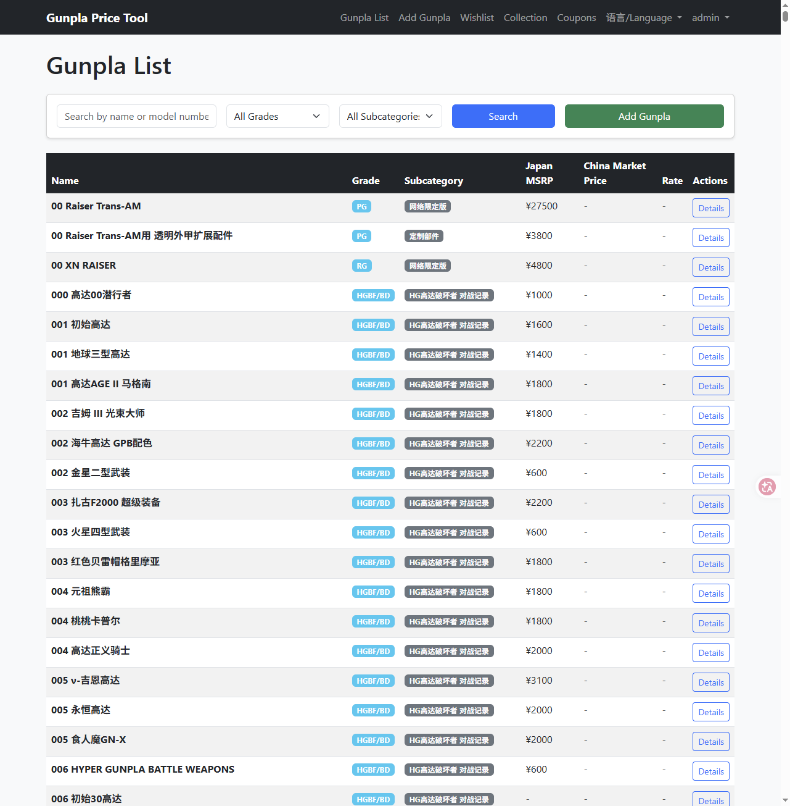
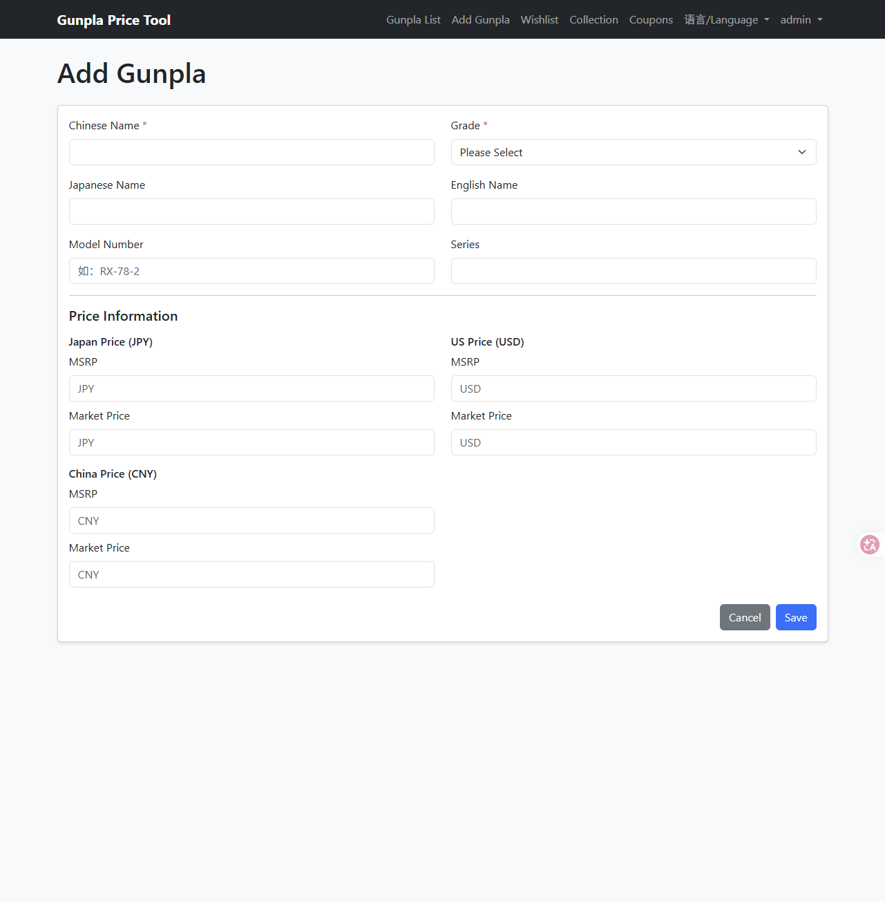
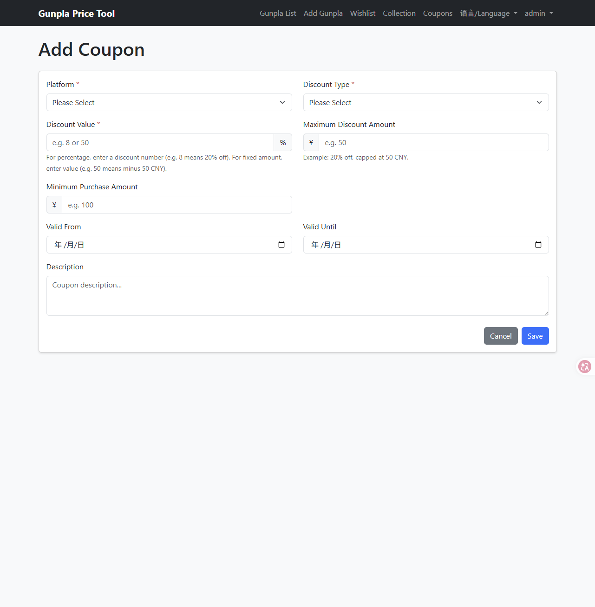
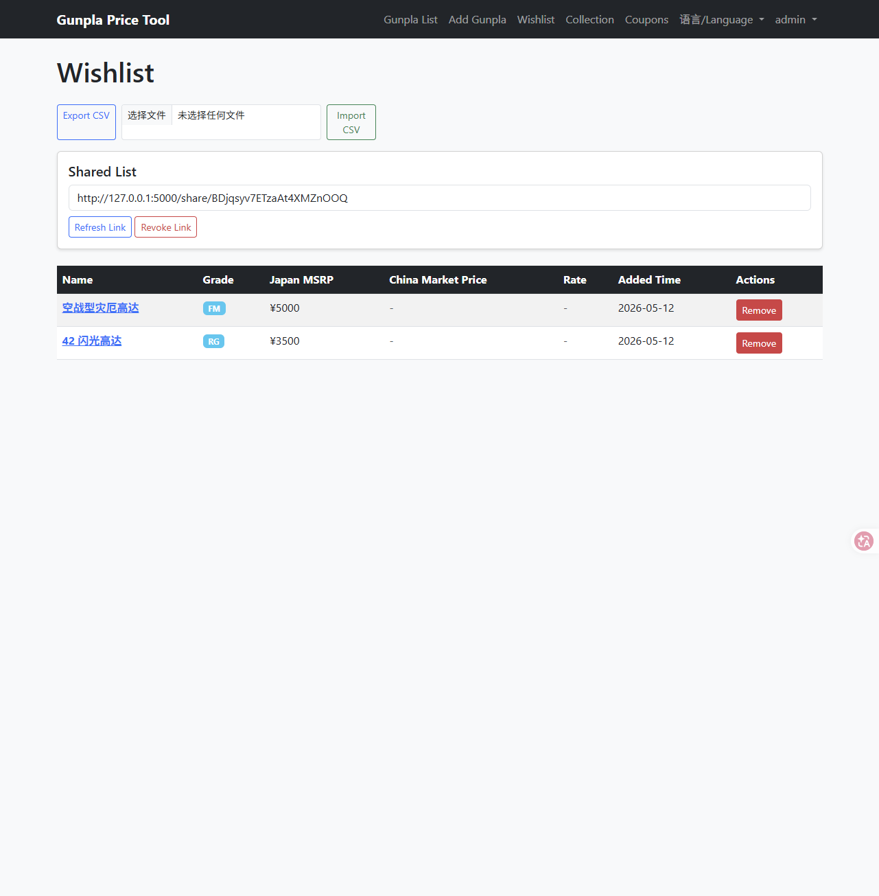

# Gunpla Price Tool

A web app for querying and managing Gunpla (Gundam model) prices with scraping, wishlist/collection, and sharing features.

> 🔗 Live Demo: https://gunpla-price-tool-bjom.onrender.com
> 👥 ~30 active users in Chinese Gunpla hobbyist community
> 🌐 Bilingual UI (Chinese / English)

## Why I Built This

Gunpla prices fluctuate constantly across Japan, US, and China markets,
and the coupon ecosystem is tricky. Most coupons only apply to special
editions with premium pricing, requiring extra math to verify whether a
deal is actually good. I built this first for my own collecting workflow,
then shared it with a QQ group of fellow hobbyists.

## Tech Stack

- **Backend**: Python, Flask, SQLAlchemy
- **Database**: SQLite (dev) / PostgreSQL (production)
- **Auth**: Flask-Login
- **Frontend**: HTML/CSS/JS, bilingual i18n
- **Deployment**: Render
- **Scraping**: requests, BeautifulSoup, IP rotation

## Features

- Multi-region price display (JPY, USD, CNY)
- Auto price conversion
- Wishlist and collection management
- Coupon analysis tools
- Category and keyword search
- Grade-specific scrapers with subcategory detection
- CSV import/export and shareable list links
- Optional user accounts (login/register)

## Screenshots






## Quick Start

### 1) Install dependencies

```bash
python -m pip install -r requirements.txt
```

On Windows (recommended), you can also use:

```bash
py -m pip install -r requirements.txt
```

### 2) Run the app

Cross-platform:

```bash
python app.py
```

Windows launcher script:

```bash
.\运行应用.bat
```

### 3) Open in browser

Visit http://localhost:5000

### Windows notes

- The launcher script checks for `py` / `python` / `python3` automatically.
- If dependencies are missing, it prints the install command and pauses so the window does not close immediately.
- This project uses SQLite by default for local development. PostgreSQL driver (`psycopg2-binary`) is mainly needed for production/Render.

## Update Notes (2026-05-12)

- Added user-facing bilingual UI (Chinese/English) with a navbar language switcher (`语言/Language`).
- Translated core pages and common flash messages, including home, auth, gunpla list/detail/add, wishlist/collection/share, and coupons.
- Improved Windows startup experience by strengthening `运行应用.bat` checks and adding clearer dependency/startup error hints.
- Updated setup docs for current Windows workflow and Python dependency installation.

## Project Structure

```
gunpla_price_tool/
├── app.py               # Flask app
├── models.py            # Database models
├── config.py            # Config (rates, secrets)
├── requirements.txt     # Python dependencies
├── docs/                # Usage and maintenance docs
├── scripts/             # Tooling scripts
│   ├── scrapers/         # Grade-specific scrapers
│   ├── migrations/       # Database migrations
│   ├── debug/            # Debug scripts
│   └── examples/         # Examples
├── templates/           # HTML templates
└── static/              # Static assets
```

## Database

SQLite is used by default (file: `gunpla.db`). Tables are created on first run.

For production, use PostgreSQL (Render provides a free tier).

## Default Data (CSV Seed)

If the database is empty, the app will load `data/seed_gunpla.csv` on startup.
Use `scripts/migrations/export_gunpla_to_csv.py` to regenerate the seed from local `gunpla.db`.

## Scrapers

Scrapers live in `scripts/scrapers/` and target specific grades:

- RG, PG, MG
- HGUC, HGGTO, HGBF/BD
- 30MM, SDCS, FM, HGIBO, EG

Each scraper filters out non-target grades and non-priced items.

## User Accounts and Sharing

- Register/Login/Logout via Flask-Login
- Wishlist and collection are user-specific when logged in
- CSV import/export for lists
- Shareable read-only list links

## Deployment (Render)

This project includes:

- `Procfile` with `gunicorn app:app`
- `requirements.txt` including `gunicorn`

When deploying on Render:

- Build: `pip install -r requirements.txt`
- Start: `gunicorn app:app`
- Set `SECRET_KEY` in environment variables

## Notes

- Exchange rates can be adjusted in `config.py`.
- SQLite data on free hosting may be ephemeral.

